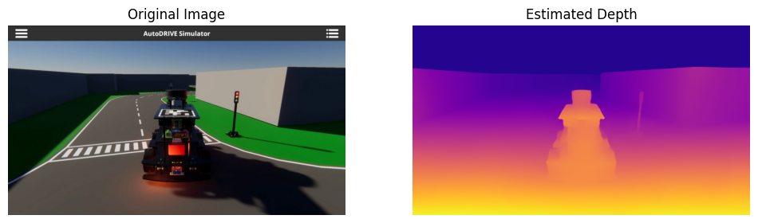

# RGB2DEPTH

🎥 Your camera can understand depth - no LiDAR, no stereo, just pixels. Using the [Depth Anything](https://depth-anything.github.io) model, a simple RGB video can be turned into a depth map!

**What’s happening under the hood?**

✅ A Vision Transformer (ViT) pretrained on huge image datasets learns spatial geometry almost for free

✅ A lightweight decoder converts those features into dense depth predictions

✅ The pipeline works on any image or video - from city scenes to random phone footage

✅ The result is like giving your camera a sense of space and distance

Depth estimation is one of those "quiet revolutions" in vision, which bridges 2D perception and 3D understanding!
